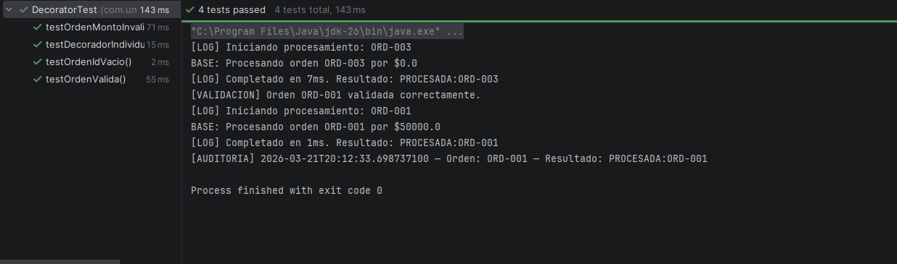

## Descripción del proyecto

Este proyecto corresponde al laboratorio de Patrones de Diseño donde se implementan los patrones estructurales Decorator y Facade sobre un sistema de tienda virtual desarrollado previamente con los patrones Adapter y Composite.

El objetivo es demostrar cómo extender funcionalidades sin modificar el código base y cómo simplificar el acceso a subsistemas complejos mediante una interfaz unificada.

## Patrones implementados

## Patrón Decorator
El patrón Decorator se utiliza para agregar funcionalidades adicionales al servicio de procesamiento de órdenes sin modificar la clase base.

## Patrón Facade
El patrón Facade se implementa para simplificar el subsistema de notificaciones.

## Cómo ejecutar el proyecto
Entrar al proyecto:

cd tienda-patrones-estructurales

Compilar el proyecto:

mvn clean package

Ejecutar las pruebas:

mvn test

Si todo funciona correctamente debe aparecer:

BUILD SUCCESS

## Estructura del proyecto
src/main/java/com/universidad/tienda
adapter
composite
decorator
facade

src/test/java/com/universidad/tienda
DecoratorTest

## Capturas

